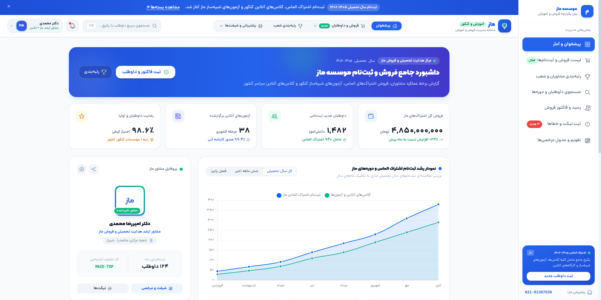

<div align="center">



# ماز CRM

### سامانه یکپارچه مدیریت آموزش، فروش و داوطلبان ماز

داشبوردی متمرکز و راست‌به‌چین برای مدیریت فروش، اشتراک‌ها، داوطلبان، آزمون‌ها و فرایندهای پشتیبانی

<br />


<br /><br />

**[🚀 مشاهده نسخه دمو](https://amirrezesf.github.io/Maze-CRM/)**

</div>

<br />

<div dir="rtl">

## 📑 فهرست مطالب

- [معرفی](#-معرفی)
- [امکانات](#-امکانات)
- [فناوری‌های استفاده‌شده](#-فناوریهای-استفادهشده)
- [شروع سریع](#-شروع-سریع)
- [مسیرهای برنامه](#-مسیرهای-برنامه)
- [نحوه احراز هویت](#-نحوه-احراز-هویت)
- [ساختار پروژه](#-ساختار-پروژه)
- [اسکریپت‌ها](#-اسکریپتها)
- [نکات طراحی](#-نکات-طراحی)
- [مجوز](#-مجوز)

---

## 🧭 معرفی

**ماز CRM** یک داشبورد مبتنی بر Nuxt 4 برای بخش عملیاتی یک کسب‌وکار آموزشی است. رابط کاربری آن برای تیم‌های فارسی‌زبان طراحی شده و از چیدمان راست‌به‌چین، تایپوگرافی فارسی، نمودارهای فروش، نمایش ساختاریافته داده‌ها و دسترسی سریع به جریان‌های کاری رایج CRM بهره می‌برد.

> [!NOTE]
> این پروژه در حال حاضر به‌صورت یک تجربه‌ی فرانت‌اندی کامل ارائه می‌شود که ورود کاربر را شبیه‌سازی می‌کند و وضعیت اولین ورود را به‌صورت محلی ذخیره می‌کند. این پروژه پایه‌ای مناسب برای اتصال به احراز هویت واقعی، APIها و سرویس‌های داده‌ی عملیاتی است.

**🌐 نسخه نمایشی زنده:** [amirrezesf.github.io/Maze-CRM](https://amirrezesf.github.io/Maze-CRM/)

---

## ✨ امکانات

| | بخش | توضیحات |
| :-: | --- | --- |
| 📊 | **داشبورد** | خلاصه‌ی یک‌نگاه از فروش، ثبت‌نام‌ها، اشتراک‌ها و عملکرد |
| 💰 | **فضای کاری فروش** | شاخص‌های فروش، بسته‌ها و صفحه‌ی جزئیات هر فروش |
| 🗂️ | **جدول‌ها** | رکوردهای ساختاریافته‌ی CRM برای مرور و پیگیری آسان |
| 🔍 | **جستجو** | مسیر جستجوی اختصاصی برای یافتن سریع رکوردها |
| 🏖️ | **مدیریت مرخصی** | نمای تقویمی برای مرخصی‌ها و وضعیت حضور |
| 🎫 | **خطاها و پشتیبانی** | فضایی برای تیکت‌ها، پیام‌ها و پیگیری‌های عملیاتی |
| 🔤 | **رابط فارسی‌محور** | جهت RTL همراه با فونت‌های Dana، Kalameh و Poppins |
| 📈 | **نمودار و تاریخ** | Chart.js، Vue Chart.js، Day.js، پشتیبانی از تقویم جلالی و انتخابگر تاریخ فارسی |
| 🔐 | **دروازه‌ی اولین ورود** | بازدیدکنندگان جدید ابتدا به `/login` هدایت می‌شوند و پس از اولین ورود موفق، وضعیت در localStorage مرورگر ذخیره می‌شود |

---

## 🛠️ فناوری‌های استفاده‌شده

| لایه | فناوری |
| --- | --- |
| فریم‌ورک | Nuxt 4، Vue 3، Vue Router |
| زبان | TypeScript |
| استایل‌دهی | Tailwind CSS، SCSS |
| نمودارها | Chart.js، Vue Chart.js |
| تاریخ | Day.js، Jalaliday، Vue Persian Date Picker |
| آیکون‌ها | Ionicons |
| محیط اجرا | Node.js |

---

## 🚀 شروع سریع

### پیش‌نیازها

- Node.js نسخه‌ی ۲۰ یا بالاتر (توصیه می‌شود)
- npm نسخه‌ی ۱۰ یا بالاتر (توصیه می‌شود)

### ۱. نصب وابستگی‌ها

```bash
npm install
```

### ۲. اجرای سرور توسعه

```bash
npm run dev
```

آدرس [http://localhost:3000](http://localhost:3000) را در مرورگر باز کنید. سرور توسعه‌ی Nuxt روی تمام رابط‌های شبکه گوش می‌دهد؛ بنابراین از دستگاه‌های دیگر در شبکه‌ی محلی نیز قابل دسترسی است.

### ۳. ساخت نسخه‌ی تولید

```bash
npm run build
```

برای پیش‌نمایش نسخه‌ی ساخته‌شده به‌صورت محلی:

```bash
npm run preview
```

برای ساخت نسخه‌ی استاتیک:

```bash
npm run generate
```

> [!TIP]
> با هر push روی شاخه‌ی `main`، پروژه به‌صورت خودکار ساخته (generate) و از طریق [`.github/workflows/deploy-pages.yml`](.github/workflows/deploy-pages.yml) روی GitHub Pages مستقر می‌شود.

---

## 🗺️ مسیرهای برنامه

| مسیر | کاربرد |
| --- | --- |
| `/login` | صفحه‌ی ورود و نقطه‌ی شروع بازدید اول |
| `/` | داشبورد اصلی CRM |
| `/sales` | نمای کلی فروش |
| `/sales/:id` | جزئیات یک فروش |
| `/tables` | جدول‌های داده‌ی CRM |
| `/search` | فضای جستجو |
| `/leave` | مدیریت مرخصی |
| `/faults` | تیکت‌ها و پیام‌های پشتیبانی |

---

## 🔐 نحوه احراز هویت

جریان ورود فعلی در نسخه‌ی نمایشی، عمداً فقط در سمت فرانت‌اند پیاده‌سازی شده است:

1. بازدیدکننده‌ای که کلید `maze-crm-has-logged-in-before` را در localStorage ندارد، به `/login` هدایت می‌شود.
2. ارسال موفق فرم رمز عبور یا رمز یک‌بار مصرف (OTP)، این کلید را ذخیره کرده و کاربر را به داشبورد می‌برد.
3. بازدیدکنندگان بازگشتی مستقیماً به داشبورد هدایت می‌شوند و با پیمایش عادی نمی‌توانند صفحه‌ی ورود را دوباره باز کنند.

> [!WARNING]
> این سازوکار برای تجربه‌ی نمونه‌ی اولیه مفید است، اما **یک مرز امنیتی محسوب نمی‌شود**. در یک پیاده‌سازی واقعی باید آن را با احراز هویت مبتنی بر سرور، کوکی‌ها یا توکن‌های امن، انقضای نشست و محافظت از مسیرها بر پایه‌ی سطح دسترسی جایگزین کرد.

برای بازنشانی وضعیت ورود در نسخه‌ی نمایشی، این دستور را در کنسول مرورگر اجرا کنید:

```js
localStorage.removeItem('maze-crm-has-logged-in-before')
```

---

## 🧱 ساختار پروژه

```text
app/
├── components/       کامپوننت‌های قابل‌استفاده‌ی مجدد (داشبورد، فرم، نمودار و ناوبری)
├── layouts/          چیدمان‌های مشترک برنامه
├── middleware/       محافظ سراسری مسیرها برای اولین ورود
├── pages/            مسیرهای مبتنی بر فایل Nuxt
├── plugins/          یکپارچه‌سازی‌های سمت کلاینت و ابزارهای ناوبری
├── assets/           فونت‌ها، استایل‌ها، تصاویر و دارایی‌های بصری
└── types/            تعریف نوع‌های Nuxt و پروژه
```

---

## 📜 اسکریپت‌ها

| دستور | توضیحات |
| --- | --- |
| `npm run dev` | اجرای سرور توسعه روی پورت ۳۰۰۰ |
| `npm run build` | ساخت برنامه‌ی Nuxt برای محیط تولید |
| `npm run preview` | پیش‌نمایش نسخه‌ی تولید |
| `npm run generate` | تولید سایت استاتیک |
| `npm run lint` | اجرای جایگزین موقت بررسی کد (lint) |

---

## 🎨 نکات طراحی

رابط کاربری آگاهانه برای استفاده‌ی داشبوردی بهینه شده است: سلسله‌مراتب اطلاعاتی فشرده، ناوبری سریع، چیدمان‌های واکنش‌گرا و تایپوگرافی خوانا برای فارسی. برنامه در سطح سند از `dir="rtl"` و `lang="fa"` استفاده می‌کند و فونت‌ها و کلاس‌های Tailwind پایه‌ی بصری صفحه‌های CRM را می‌سازند.

---

## 📄 مجوز

این پروژه خصوصی است و در حال حاضر مجوز متن‌باز ندارد.

</div>

<br />

<div align="center">

ساخته‌شده با ❤️

</div>
